# h6-Miniprojekti

Tekijät: Samuli Toropainen, Lilja Sharifi, Andres Kimi Nyrhi

* [a) Userforge TSN asennus](#a-Userforge-tsn-asennus)
* [b) Käyttöönotto](#b-käyttöönotto)
* [c) Miten se toimii](cf-miten-se-toimii)
* [d) Lisenssi](#d-Lisenssi)


# a) Userforge TSN asennus

Userforge TSN vaatii toimiakseen Ansiblen asennuksen. Asennusohjeet löytyvät verkosta.

## Ansible Asennuksen tarkistaminen

Aloitettiin Ansiblen-version tarkistamisella. Lähtökohtana tilanne, jossa Ansible on jo asennettuna.

* **`ansible --version`** - version tarkistaminen

* Uusin versio oli asennettuna. 

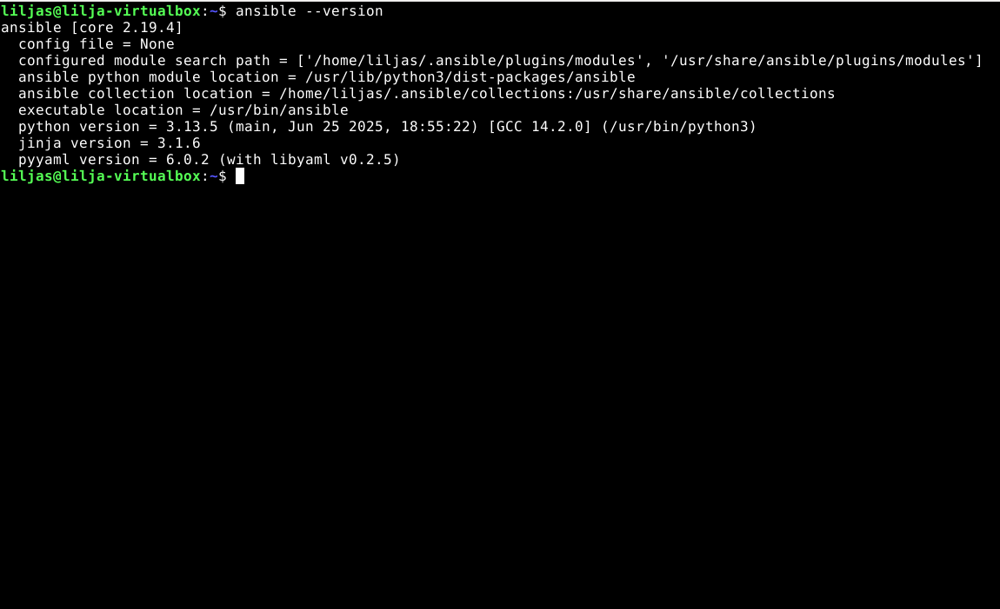

_Uusin versio asennettu_

## Git clone 

Varaston (repon) kloonaaminen etenee seuraavasti:

* **`git clone https://github.com/LilJayyy/h6-Miniprojekti.git`** - kloonataan repo

* **`cd h6-Miniprojekti`** - repon sisälle

* **`ls`** - tarkistetaan mitä sisällä tiedostoissa

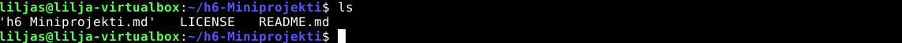

_Repon sisältö_

## Users.yml tiedoston sisällön luominen

Lähdetään etenemään avaamalla tekstieditori micro jolla pääsee luomaan sisällön tiedostolle

* **`micro users.yml`** - avataan editori

Sisällöksi alla oleva eli käyttäjien nimet:

````
users:
  - name: matti
  - name: liisa
  - name: maija
````
Tallennetaan tiedot `ctrl + S` ja poistutaan `ctrl + Q`

### Tarkistetaan onnistuiko sisällön luonti

* **`cat users.yml`** - katsotaan tiedoston sisälle


_Users.yml sisältö_

## Playbook.yml tiedoston sisällön luominen

* **`micro playbook.yml`** - playbookille sisältö yhdellä käyttäjällä

Sisällöksi playbook.yml tekstitiedostoon:

````
---
- name: Userforge TSN manage users
  hosts: localhost
  connection: local
  become: yes

  tasks:
    - name: create user Matti
      ansible.builtin.user:
        name: matti
        state: present
````

  -`hosts` kertoo ajetaanko paikallisesti, tässä tapauksessa kyllä eli `localhost`
  
  -`become: yes` Sudo-oikeuksilla
  
  -`ansible.builtin.user` tällä moduulilla käyttäjä luodaan
  
  -`state: present` tarkistaa olemassaolon käyttäjän osalta


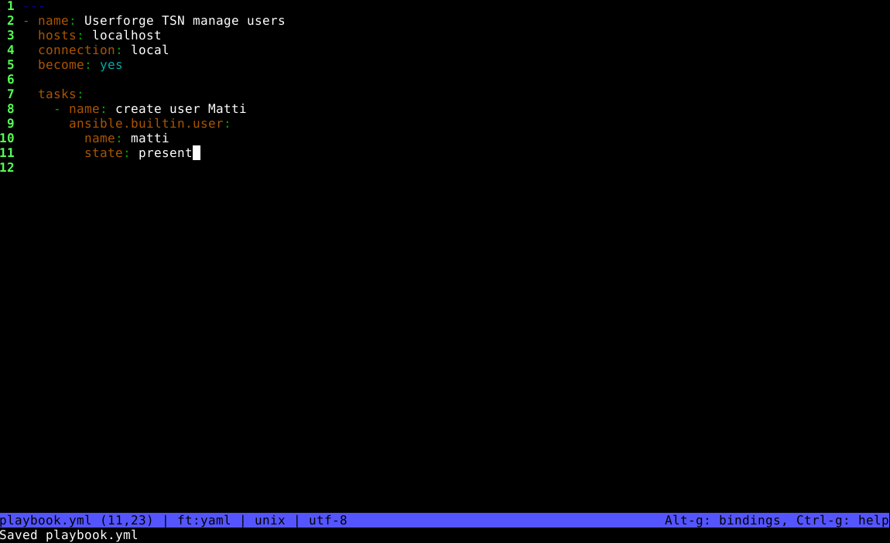

_Playbook.yml sisältö_

* **`cat playbook.yml`** - katsotaan tiedoston sisälle

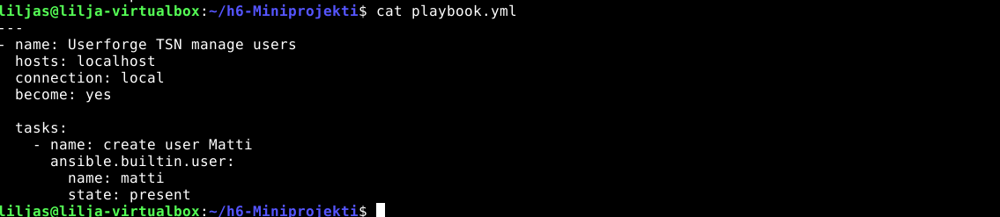

_Sisältö oikein playbook.yml tiedoston sisällä_

## Ajetaan playbook

* **`ansible-playbook playbook.yml --ask-become-pass`** - potkaistaan playbook käyntiin

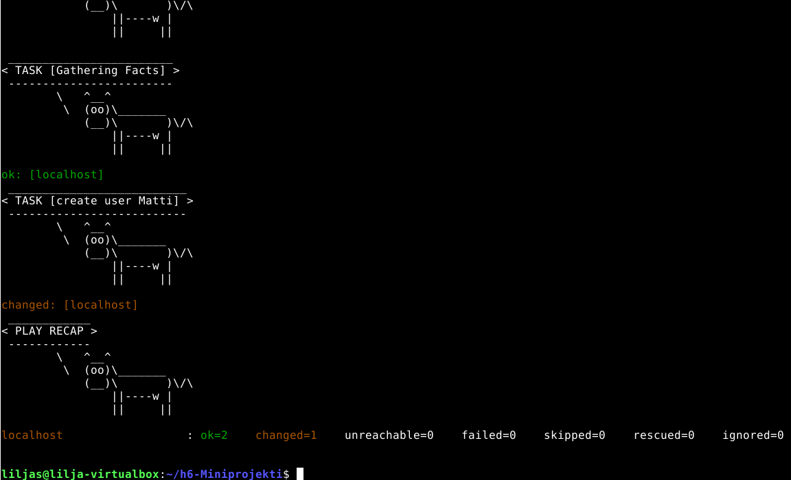

_Playbook ajettu onnistuneesti changed=1_


## Tarkistetaan onnistuiko käyttäjän Matti lisäys

* **`cat /etc/passwd | grep matti`** -

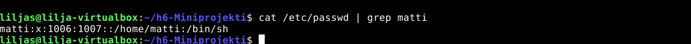

_Käyttäjä lisätty_

Matti löytyi järjestelmän tiedoista, eli käyttäjän lisäys on tehty onnistuneesti.

## Tarkistetaan onnistuuko idempotenssi

* **`ansible-playbook playbook.yml --ask-become-pass`** - potkaistaan playbook käyntiin

  
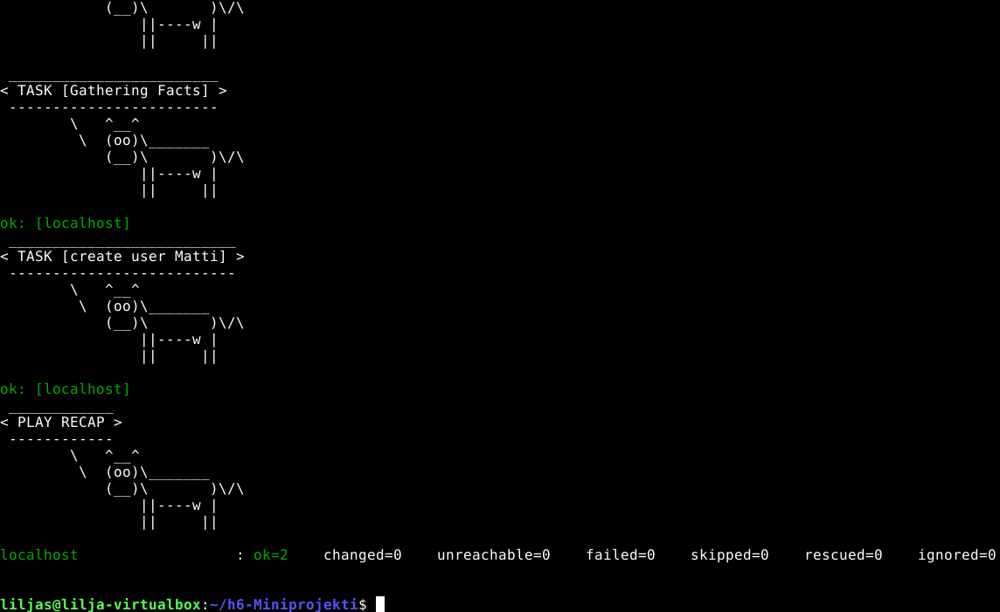

_Idempotenssi saavutettu sillä changed=0_ 

Käyttäjä "Matti" löytyi jo, eli mitään ei muutettu uuden playbookin ajon aikana. Idempotenssi on saavutettu.


## Laitetaan Playbook luomaan Users.yml tiedoston perusteella käyttäjät

**Välimuistutuksena** on tärkeää ymmärtää tehdä muutokset **projektikansion** sisällä eli 

* **`cd ~/h6-Miniprojekti`**  sisältä eikä kotihakemiston
  
* **`pwd`** - tarkistaa missä olet

**Tämän tehtävänosion tarkoituksena on ottaa käyttäjälista käyttöön eli tehdä **silmukka** `Playbook.yml`:ään niin että se pystyy lukemaan `Users.yml` käyttäjien luomista varten.**

* **`micro playbook.yml`** - lähdetään muokkaamaan playbookin sisältö

Sisällöksi alla oleva:
````
---
- name: Userforge TSN manage users
  hosts: localhost
  connection: local
  become: yes


  vars_files:
    - users.yml

    
  tasks:
    - name: Fetch from users list
      ansible.builtin.user:
        name: "{{ item.name }}"
        state: present
      loop: "{{ users }}"
````

Tallennetaan: * **`ctrl S` ja perään `ctrl Q`**

* **`ansible-playbook playbook.yml --ask-become-pass`** - ajetaan playbook ja katsoaan onnistuiko muutos

  -`vars_files` laittaa nyt playbookin lukemaan users.yml:n

  -`name: "{{ item.name }}"` tarkistaa nyt listasta ja lisää nimet

  -`loop: "{{ users }}"` - lisää useammat käyttäjät

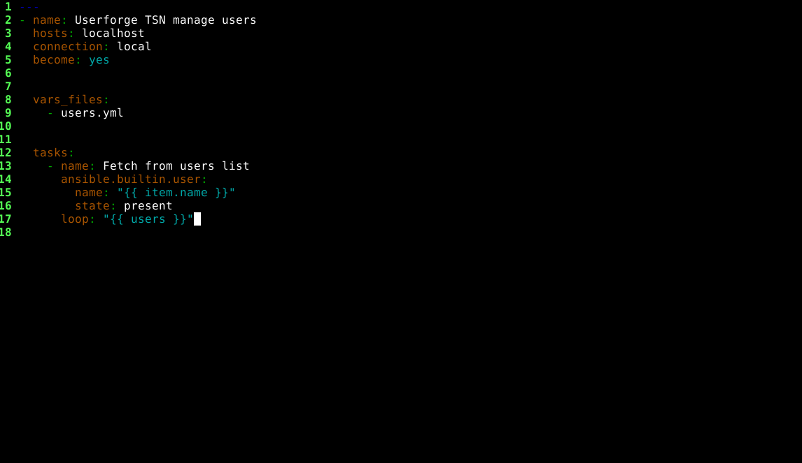

_Playbookin sisältö_

Mikäli tämä vaihe on suoritettu onnistuneesti on `liisa` ja `maija` -käyttäjät on nyt myös luotu `users.yml` -tiedostosta. 

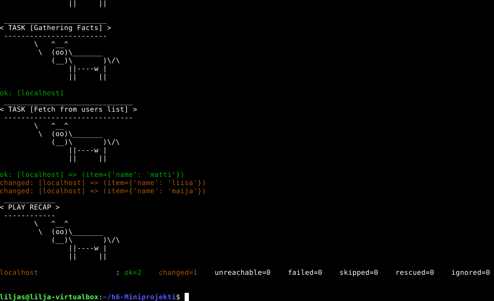

_Myös testikäyttäjät maija ja liisa luotu onnistuneesti_ 

* **`cat /etc/passwd | grep -E "matti|liisa|maija"`** - tarkistetaan lopuksi käyttäjät

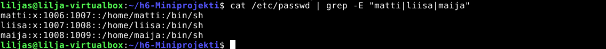

_Kaikki käyttäjät on nyt lisätty onnistuneesti_ 

### Tarkistetaan vielä idempotenssi

* **`ansible-playbook playbook.yml --ask-become-pass`** - ajetaan playbook

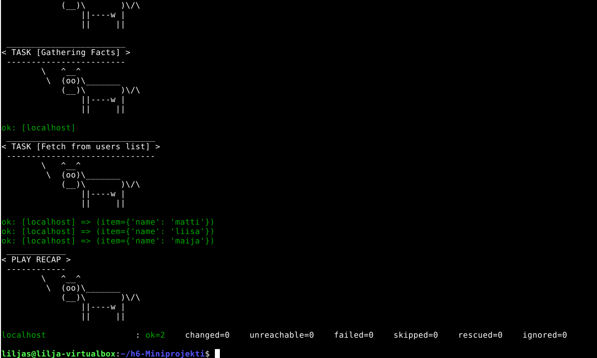

_changed=0 eli mikään ei muutu_ 


# b) Käyttöönotto


# c) Miten se toimii

KAIKI MUOKKAA TÄTÄ OSIOTA 

**--LILJAN OSUUS--**

Userforge TSN ohjelma hyödyntää toiminnassaan Ansiblen `ansible.builtin.user` moduulia. 

Moduulin tehtävänä on hakea käyttäjälista `users.yml` tiedostosta ja luoda sen perusteella käyttäjät. Tämä on projektimme **yksi totuus**.

Muutoksia hallitaan muokkaamalla `users.yml` -tiedostoa ja otetaan käyttöön kun playbook ajetaan. 

**Idempotenssi** saavutetaan niin, ettei muutoksia tehdä, jos käyttäjiin ei ole tehty muutoksia `users.yml` tiedostoon. 

**--LILJAN OSUUS--**


# d) Lisenssi

GNU General Public License v3.0 (GPLv3). 

Lisätietoja voit tarkistaa `LICENSE`-osiosta.


# Lähteet ja linkit

Ansible Community Documentation. Dokumentti. _Using variables._ Luettavissa: https://docs.ansible.com/projects/ansible/latest/inventory/implicit_localhost.html/ Luettu: 30.4.2026

Ansible Community Documentation. Dokumentti. _Playbook variables._ Luettavissa: https://docs.ansible.com/projects/ansible/latest/playbook_guide/playbooks_variables.html/ Luettu: 30.4.2026

Ansible Community Documentation. Dokumentti. _Connection details._ Luettavissa: https://docs.ansible.com/projects/ansible/latest/inventory_guide/connection_details.html/ Luettu: 30.4.2026

Michalowski, M. Spacelift. Verkkosivu. _Ansible create user._ Luettavissa: https://spacelift.io/blog/ansible-create-user/ Luettu: 30.4.2026

Dhandala, N. 2026. _How to Create Users with the Ansible user Module._ Luettavissa: https://oneuptime.com/blog/post/2026-02-21-how-to-create-users-with-the-ansible-user-module/view/ Luettu: 30.4.2026
